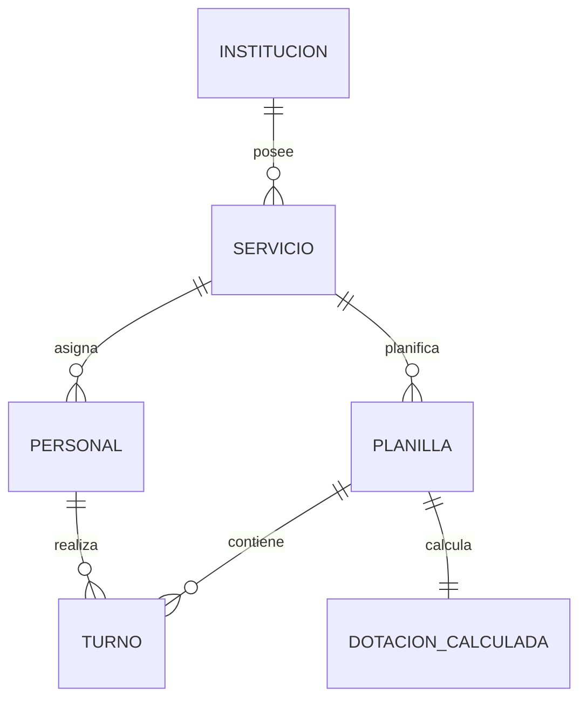

# Especificación Técnica — SADE (Sistema Automatizado de Dotación de Enfermería)

SADE es una aplicación web SPA de tipo **Desktop-First** diseñada para optimizar, calcular y gestionar el personal y los turnos de enfermería en establecimientos de salud. Está basada en la **Metodología de Balderas Pedrero** para el cálculo de la dotación y se rige por el marco legal de la **Ley 24.004 / Ley 10.780**.

---

## 01. Stack Tecnológico

La arquitectura de SADE se compone de una Single Page Application (SPA) en el frontend y un backend REST desacoplado.

### Capas de la Aplicación
1. **Frontend (Capa de Presentación):** React 18 + TypeScript + Vite.
2. **Backend (Lógica de Negocio):** Node.js + Express + TypeScript.
3. **Base de Datos:** PostgreSQL 15 + Prisma ORM.

### Tecnologías Clave por Capa
*   **Frontend:** React 18, TypeScript 5, Vite, Zustand (estado global), TanStack Query (fetching y cache), React Hook Form, Tailwind CSS, Recharts (gráficos), jsPDF.
*   **Backend:** Node.js 20 LTS, Express 4, TypeScript, Prisma ORM, Zod (validación de esquemas), JWT Auth, date-fns, Winston (logger).
*   **Infraestructura:** PostgreSQL 15, Docker Compose, Nginx (reverse proxy), GitHub Actions CI, Railway / Render (despliegue).

> [!NOTE]
> **Desktop-First:** Debido a la naturaleza densa de la grilla mensual (31 columnas), la interfaz está optimizada para pantallas con una resolución mínima de 1280px. En dispositivos móviles se ofrecerá una vista de solo lectura de tipo "Ficha Individual" por enfermero.

---

## 02. Arquitectura y Estructura del Sistema

### Estructura de Carpetas (Frontend)
```tree
src/
├── pages/
│   ├── LoginPage.tsx
│   ├── DashboardPage.tsx          ← Pantalla 2 (Métricas)
│   ├── ConfigPage.tsx             ← Pantalla 1 (Configuración)
│   └── GridPage.tsx               ← Pantalla 3 (Grilla principal)
│
├── components/
│   ├── layout/
│   │   ├── Topbar.tsx             ← Logo SADE + Logo Inst. + Nav + User
│   │   └── Sidebar.tsx
│   ├── grid/
│   │   ├── ShiftGrid.tsx          ← Grilla mensual principal
│   │   ├── ShiftCell.tsx          ← Celda individual + dropdown + alertas
│   │   ├── FrancoCounter.tsx      ← Contador dinámico por fila
│   │   └── DayHeader.tsx          ← Cabecera de día (feriado, fin de semana)
│   ├── dashboard/
│   │   ├── DotacionSummary.tsx    <-- Resultado del algoritmo
│   │   └── TurnoChart.tsx         <-- Distribución por turno (dona)
│   └── staff/
│       ├── StaffForm.tsx          ← ABM de personal
│       └── StaffTable.tsx
│
├── store/                         ← Estado global Zustand
│   ├── gridStore.ts               ← Estado de la planilla y turnos
│   ├── staffStore.ts              ← Estado del personal
│   └── configStore.ts             ← Estado de configuración e índices
│
├── services/                      ← Cliente de API y llamadas REST
│   ├── api.ts                     ← Cliente Axios + interceptores
│   ├── dotacion.service.ts
│   ├── staff.service.ts
│   └── grid.service.ts
│
├── hooks/
│   ├── useShiftValidation.ts      ← Validaciones de reglas REQ-001 a REQ-006
│   ├── useFrancos.ts              ← Cálculos de francos dinámicos
│   └── usePdf.ts                  ← Generador de planilla PDF imprimible
│
└── utils/
    ├── dotacion.calc.ts           ← Fórmulas P, B, Z, Q, S, V
    ├── francos.calc.ts
    └── constants/
        └── indices.ts             ← Base de datos de índices por especialidad
```

### Endpoints de la API REST
| Método | Endpoint | Descripción | Requiere Auth |
| :--- | :--- | :--- | :--- |
| `POST` | `/api/auth/login` | Autenticación de usuario, retorna JWT | No |
| `GET` | `/api/staff` | Listar personal del servicio activo | Sí |
| `POST` | `/api/staff` | Crear ficha de personal de enfermería | Sí |
| `PUT` | `/api/staff/:id` | Actualizar datos del enfermero | Sí |
| `GET` | `/api/services` | Obtener servicios e índices disponibles | Sí |
| `POST` | `/api/dotacion/calculate` | Ejecutar motor de cálculo Balderas | Sí |
| `GET` | `/api/grid/:year/:month/:serviceId` | Obtener la grilla del mes y servicio | Sí |
| `PUT` | `/api/grid/cell` | Asignar o modificar tipo de turno en celda | Sí |
| `GET` | `/api/grid/validate/:id` | Ejecutar validaciones REQ sobre toda la grilla | Sí |
| `GET` | `/api/holidays/:year` | Consultar feriados nacionales del año | Sí |
| `GET` | `/api/institutions/:id` | Obtener configuración y logo de la institución | Sí |
| `PUT` | `/api/institutions/:id/logo` | Subir o actualizar logo de la institución | Sí (Admin) |

---

## 03. Modelo de Datos y Entidades (Prisma / PostgreSQL)

SADE se organiza en un esquema de 6 entidades principales:



### 1. Institucion
*   `id`: `String` (UUID, PK)
*   `nombre`: `String`
*   `logo_url`: `String` (nullable, guarda la ruta del logo cargado)
*   `nivel_complejidad`: `Int` (2 o 3, define ratio de profesionalización)
*   `created_at`: `DateTime` (default `now()`)

### 2. Servicio
*   `id`: `String` (UUID, PK)
*   `institucion_id`: `String` (FK a `Institucion`)
*   `nombre`: `String` (ej. "Terapia Intensiva", "Clínica Médica")
*   `especialidad_key`: `String` (mapea con base de datos inmutable de índices)
*   `camas`: `Int`
*   `tipo_calculo`: `TipoCalculo` (Enum: `indice`, `ratio`) — define si el servicio usa la fórmula $P = (I \times C) / J$ o un ratio fijo de perfil.
*   `perfil_minimo_turno`: `String` (varchar, nullable) — describe el perfil mínimo requerido por turno (ej: "1 EE + 1 EG"). Null si el servicio usa índice estándar sin restricción de perfil adicional.
*   `ratio_min`: `String` (varchar, nullable) — estándar mínimo para servicios tipo ratio (ej: "1 EE/2 camas").
*   `ratio_max`: `String` (varchar, nullable) — estándar máximo para servicios tipo ratio.

### 3. Personal
*   `id`: `String` (UUID, PK)
*   `servicio_id`: `String` (FK a `Servicio`)
*   `nombre`: `String`
*   `apellido`: `String`
*   `dni`: `String` (Unique)
*   `matricula`: `String` (Unique)
*   `nivel_formacion`: `NivelFormacion` (Enum: `LICENCIADO`, `ENFERMERO_PROFESIONAL`, `ENFERMERO_ESPECIALISTA`, `AUXILIAR`)
*   `jornada_horas`: `Int` (estándar 6 o 8 horas)
*   `turno_fijo`: `TurnoTipo` (Enum nullable: `M`, `T`, `N`, null para rotativos)
*   `antiguedad_anos`: `Int`
*   `estado`: `PersonalEstado` (Enum: `ACTIVO`, `VACACIONES`, `LICENCIA_ENFERMEDAD`, `CAPACITACION`)
*   `compensatorio_pendiente`: `Int` (Francos compensatorios que se trasladan del mes anterior, default 0)
*   `created_at`: `DateTime` (default `now()`)

### 4. Planilla (Grid Header)
*   `id`: `String` (UUID, PK)
*   `servicio_id`: `String` (FK a `Servicio`)
*   `anio`: `Int`
*   `mes`: `Int` (1 al 12)
*   `dias_mes`: `Int` (28 al 31)
*   `feriados`: `Int[]` (Arreglo con los días feriados del mes, ej: `[20, 25]`)
*   `estado`: `PlanillaEstado` (Enum: `BORRADOR`, `CERRADA`)

### 5. Turno (Celda)
*   `id`: `String` (UUID, PK)
*   `planilla_id`: `String` (FK a `Planilla`)
*   `personal_id`: `String` (FK a `Personal`)
*   `dia`: `Int` (1 al 31)
*   `tipo`: `TurnoTipo` (Enum: `M` - Mañana, `T` - Tarde, `N` - Noche, `F` - Franco)
*   `es_compensatorio`: `Boolean` (Indica si el franco fue generado por feriado trabajado, default false)
*   `alerta_nivel`: `AlertaNivel` (Enum nullable: `YELLOW`, `ORANGE`, `RED`)
*   `updated_at`: `DateTime` (default `now()`)

### 6. DotacionCalculada
*   `id`: `String` (UUID, PK)
*   `planilla_id`: `String` (FK a `Planilla`, Unique)
*   `P`: `Decimal` (Personal base calculado)
*   `B`: `Decimal` (Personal para ausentismo)
*   `Z`: `Decimal` (Total requerido)
*   `Q_manana`: `Decimal` (Personal requerido para la Mañana)
*   `Q_tarde`: `Decimal` (Personal requerido para la Tarde)
*   `Q_noche`: `Decimal` (Personal requerido para la Noche)
*   `Q_franco`: `Decimal` (Personal estimado en franco)

---

## 04. Parámetros de Entrada

Configurados por el usuario en la **Pantalla 1** para inicializar el motor de cálculo:

1.  **Servicio / Área:** Select que carga la configuración del servicio. Autocompleta el rango permitido del índice `I`.
2.  **Índice de Cuidado (I):** Horas promedio de atención requeridas por paciente en 24 horas. Autocompletado, pero ajustable mediante un slider o control dentro del rango permitido.
3.  **Camas Ocupadas / Disponibles (C):** Entero mayor o igual a 1.
4.  **Jornada Laboral (J):** Horas diarias por profesional. Valor fijo estándar = 8 horas.
5.  **Mes y Año:** DatePicker que define los días del mes y carga automáticamente los feriados nacionales.
6.  **Nivel de Complejidad (NC):** Nivel de la institución (2do o 3er Nivel), que define los ratios de profesionalización (70/30 o 80/20).
7.  **Feriados del Mes:** Lista de días interactiva (cargada por API de feriados, editable haciendo click en un minicalendario).

---

## 05. Índices de Cuidado por Especialidad

Base de datos inmutable embebida en `constants/indices.ts`. Esta base de datos representa la fuente de verdad oficial según el Anexo 1 UNRC.

#### Tabla A — Especialidades médicas (horas enfermera-paciente en 24hs)
| Especialidad | De | A | Perfil |
| :--- | :--- | :--- | :--- |
| Alergología e Inmunología | 3.0 | 3.4 | EG |
| Cardiología | 3.0 | 3.4 | EG |
| Dermatología | 3.0 | 3.4 | EG |
| Endocrinología | 3.0 | 3.4 | EG |
| Hematología | 4.0 | 4.8 | EG |
| Infectología | 4.0 | 4.8 | EG |
| Medicina Interna | 4.0 | 4.8 | EG |
| Nefrología | 3.0 | 4.8 | EG |
| Neumología | 3.0 | 3.4 | EG |
| Neurología | 3.4 | 4.8 | EG |
| Oncología | 3.4 | 4.0 | EG |
| Psiquiatría | 3.4 | 4.0 | EG |
| Reumatología | 3.4 | 4.0 | EG |
| Ginecología | 3.0 | 3.4 | EG |
| Obstetricia | 3.0 | 3.4 | EG |
| Perinatología | 8.0 | 12.0 | EG |
| Alojamiento conjunto | 3.4 | 4.0 | EG |

#### Tabla B — Especialidades quirúrgicas (horas enfermera-paciente en 24hs)
| Especialidad | De | A | Perfil |
| :--- | :--- | :--- | :--- |
| Cirugía de cabeza y cuello | 3.0 | 3.4 | EG |
| Cirugía cardiovascular | 4.0 | 4.8 | EG |
| Cirugía general | 3.4 | 4.0 | EG |
| Cirugía plástica y reconstructiva | 3.0 | 3.8 | EG |
| Gastrocirugía | 3.4 | 4.8 | EG |
| Neurocirugía | 3.4 | 4.0 | EG |
| Oftalmología | 3.0 | 3.4 | EG |
| Otorrinolaringología | 3.0 | 3.8 | EG |
| Oncocirugia | 4.0 | 4.8 | EG |
| Traumatología y ortopedia | 4.0 | 4.8 | EG |
| Proctología | 3.4 | 4.0 | EG |
| Urología | 3.4 | 4.0 | EG |
| Vascular periférico (Angiología) | 3.4 | 4.0 | EG |
| Ginecología quirúrgica | 3.0 | 3.4 | EG |
| Obstetricia quirúrgica | 3.0 | 3.4 | EG |
| Perinatología quirúrgica | 8.0 | 12.0 | EG |

#### Tabla C — Especialidades médico-quirúrgicas pediátricas (horas enfermera-paciente en 24hs)
> [!IMPORTANT]
> **CORRECCIÓN CRÍTICA:** Cardiología Pediátrica tenía asignado incorrectamente el índice 8.0–12.0. El valor correcto según el Anexo 1 UNRC es 4.5–4.8.

| Especialidad | De | A | Perfil |
| :--- | :--- | :--- | :--- |
| Cardiología pediátrica | 4.5 | 4.8 | EG |
| Cuidados intensivos pediátricos | 8.0 | 12.0 | EE |
| Cunero fisiológico | 3.0 | 3.4 | EG |
| Gastroenterología pediátrica | 4.0 | 4.8 | EG |
| Hematología pediátrica | 4.0 | 4.8 | EG |
| Infectología pediátrica | 4.0 | 4.8 | EG |
| Nefrología pediátrica | 4.5 | 4.8 | EG |
| Neonatología | 8.0 | 12.0 | EE |
| Neumología pediátrica | 4.0 | 4.8 | EG |
| Neurología pediátrica | 4.0 | 4.8 | EG |
| Neurocirugía pediátrica | 4.0 | 4.8 | EG |
| Oftalmología pediátrica | 3.4 | 4.0 | EG |
| Oncología pediátrica | 4.5 | 4.8 | EG |
| Otorrinolaringología pediátrica | 3.4 | 3.8 | EG |
| Pediatría general | 4.0 | 4.8 | EG |
| Prematuros | 5.0 | 8.0 | EG |
| Psiquiatría pediátrica | 4.0 | 4.8 | EG |
| Traumatología y ortopedia pediátrica | 4.0 | 4.8 | EG |
| Urología pediátrica | 4.0 | 4.8 | EG |

#### Tabla D — Áreas quirúrgicas por ratio de perfil (NO usan fórmula P = I×C/J)
> [!NOTE]
> Estas áreas tienen lógica de dotación distinta — no se calcula por horas sino por ratio fijo de personal por sala, turno o unidad. Deben tratarse como un tipo de servicio especial en el modelo de datos, con campo `tipo_calculo = 'ratio'` en lugar de `tipo_calculo = 'indice'`.

| Área | Estándar mínimo (De) | Estándar máximo (A) |
| :--- | :--- | :--- |
| Central de equipos y esterilización | 1 AE/40 camas + 1 EG/100 camas | 1 AE/30 camas + 1 EG/80 camas |
| Cirugía ambulatoria | 1 AE/6 camas + 1 EG/15 camas | 1 AE/6 camas + 1 EG/10 camas |
| Hemodinámica | 1 EG/sala | 2 EG/sala |
| Radiología intervencionista | 1 AE/turno | 2 AE/turno |
| Recuperación | 1 EG/8 camillas + 1 EE/10 camillas | 1 EG/6 camillas + 1 EE/8 camillas |
| Sala de quirófano | 1 EE + 1 EG/sala | 2 EE + 1 EG/sala |
| Tococirugía — Admisión | 1 AE/consultorio | 1 EG/consultorio |
| Tococirugía — Labor | 1 EG/6 camas + 1 EE/12 camas | 1 EG/6 camas + 1 EE/10 camas |
| Tococirugía — Expulsión | 1 EG/sala | 1 EE/sala |
| Tococirugía — Puerperio bajo riesgo | 1 EG/10 camillas | 1 EG/6 camillas |

#### Tabla E — Áreas críticas por ratio de perfil (NO usan fórmula P = I×C/J)
| Área | Estándar mínimo (De) | Estándar máximo (A) |
| :--- | :--- | :--- |
| Cuidados intensivos adultos | 1 EE/2 camas | 1 EE/cama |
| Cuidados intensivos neonatología | 1 EE/2 camas | 1 EE/cama |
| Cuidados intensivos pediatría | 1 EE/2 camas | 1 EE/cama |
| Terapia intermedia adultos | 1 EE/3 camas | 1 EE/2 camas |
| Terapia intermedia pediatría | 1 EE/3 camas | 1 EE/2 camas |
| Unidad de choque adultos | 1 EE/unidad | 2 EE/unidad |
| Unidad de choque pediatría | 1 EE/unidad | 2 EE/unidad |
| Unidad de choque traumatología | 1 EE/unidad | 2 EE/unidad |
| Unidad de quemados adultos | 1 EE/unidad | 2 EE/unidad |
| Unidad de quemados pediatría | 1 EE/unidad | 1 EE/unidad |
| Unidad de trasplantes | 1 EE/unidad | 2 EE/unidad |
| Urgencias adultos | 1 EG/3 camas | 1 EE/3 camas |
| Urgencias coronarias | 1 EE/2 camas | 1 EE/cama |
| Urgencias pediátricas | 1 EE/3 camas | 1 EE/2 camas |

#### Tabla F — Consulta externa por ratio de perfil (NO usan fórmula P = I×C/J)
| Área | Estándar mínimo (De) | Estándar máximo (A) |
| :--- | :--- | :--- |
| Admisión hospitalaria | 1 AE/turno | 1 EG/turno |
| Curaciones | 1 EG/cubículo | 1 EG + 1 AE/cubículo |
| Clínica de catéteres | 1 EG/turno | 2 EG/turno |
| Clínica del dolor | 1 EG/turno | 2 EG/turno |
| Clínica de estomas | 1 EG/turno | 2 EG/turno |
| Consultorios de especialidades | 1 AE/2 consultorios | 1 AE/consultorio |
| Endoscopías | 1 EG/sala | 1 EE/sala |
| Hemodiálisis adulto | 1 EE/2 máquinas | 1 EE/2 máquinas |
| Hemodiálisis pediatría | 1 EE/máquina | 2 EE/máquina |
| Quimioterapia | 1 EG/8 tratamientos | 1 EE/8 tratamientos |
| Servicios de diagnóstico | 1 AE/turno | 1 AE/turno |
| Sala de altas | 1 AE/turno | 1 EG/turno |

---

## 06. Algoritmo de Cálculo (Metodología Balderas Pedrero)

El cálculo se ejecuta en `utils/dotacion.calc.ts`. Todos los resultados finales de dotación se redondean al entero superior (`Math.ceil`) para asegurar cobertura.

### Paso 1: Personal Base (P)
Determina el personal mínimo requerido para cubrir las 24 horas del servicio en condiciones ideales.
$$P = \frac{I \times C}{J}$$

### Paso 2: Colchón de Ausentismo Previsible (B)
Calcula el personal de reserva necesario para cubrir vacaciones, licencias y descansos ordinarios. Coeficiente estandarizado: **41%** (constante).
$$B = P \times 0.41$$

### Paso 3: Dotación Total Requerida (Z)
$$Z = P + B$$

### Paso 4: Distribución por Turnos (Q)
Segmentación de la dotación total para cubrir las 24 horas del día más los de franco.
*   **Mañana ($Q_1$):** $Z \times 0.35$ (35%)
*   **Tarde ($Q_2$):** $Z \times 0.25$ (25%)
*   **Noche ($Q_3$):** $Z \times 0.20$ (20%)
*   **Francos ($Q_f$):** $Z \times 0.20$ (20%)

> [!IMPORTANT]
> **Validación de Consistencia:** El sistema debe verificar que $Q_1 + Q_2 + Q_3 + Q_f = Z$ (redondeado). Si por errores de redondeo decimal la suma final difiere de `Math.ceil(Z)`, se ajusta el componente $Q_f$ en $\pm 1$ para balancear. Si la discrepancia supera el 1%, el sistema arroja una excepción.

### Paso 5: Composición Profesional (S / V)
Clasifica al personal requerido según su nivel formativo acorde a la complejidad del servicio:
*   **Establecimiento de 2° Nivel de Complejidad:**
    *   Profesionales ($S$): $70\%$ de la dotación total ($Z \times 0.70$)
    *   Auxiliares ($V$): $30\%$ de la dotación total ($Z \times 0.30$)
*   **Establecimiento de 3° Nivel de Complejidad:**
    *   Profesionales ($S$): $80\%$ de la dotación total ($Z \times 0.80$)
    *   Auxiliares ($V$): $20\%$ de la dotación total ($Z \times 0.20$)

---

## 07. Restricciones de Validación (REQ-001 a REQ-010)

Estas restricciones se validan en tiempo real en la grilla mensual mediante el hook `useShiftValidation.ts` y en el backend:

*   **REQ-001 — Base de Francos Ordinarios:**
    Si el mes planificado tiene 28, 29 o 30 días, la base de francos a asignar por enfermero es de **8 francos**. Si el mes tiene 31 días, la base es de **9 francos**.
*   **REQ-002 — Ajuste por Feriados del Mes:**
    Por cada feriado nacional marcado en el mes en curso, se adiciona un franco al total a gozar por el trabajador: $\text{Francos Totales} = \text{Base Francos} + \text{Feriados del Mes} + \text{Compensatorios Trasladados}$.
*   **REQ-003 — Franco Compensatorio por Feriado Trabajado:**
    Si a un enfermero se le asigna un turno de trabajo (`M`, `T` o `N`) en un día marcado como feriado, se le debe compensar. La celda se coloreará en amarillo, se sumará $+1$ al contador de francos del mes y se enviará una notificación visual.
    *   *Traslado por fin de mes:* Si el feriado trabajado es el último día del mes en curso, el franco compensatorio se traslada al mes siguiente sumando $+1$ al campo `compensatorio_pendiente` de la entidad `Personal`.
    *   *Justificación del Turno N:* El turno nocturno (`N`) que inicia a las 22:00hs de un día feriado también genera franco compensatorio según la normativa laboral argentina.
*   **REQ-004 — Límite de Fatiga Circadiana (BLOQUEANTE):**
    Queda terminantemente prohibido asignar más de **3 turnos N (Noche) consecutivos** a un enfermero. La asignación de un 4° turno `N` consecutivo está bloqueada. Lanza alerta visual **Roja** y bloquea la escritura.
*   **REQ-005 — Límite de Continuidad Laboral (BLOQUEANTE):**
    Un enfermero puede trabajar un máximo de **5 días consecutivos** (independientemente de si es `M`, `T` o `N`) sin gozar de un franco (`F`). Intentar colocar un 6° día de trabajo consecutivo activa una alerta **Roja** y bloquea la acción.
*   **REQ-006 — Descanso Mínimo Inter-jornada (PRECAUCIÓN):**
    Debe respetarse un descanso mínimo de **16 horas** entre turnos sucesivos. Se consideran ilegales los siguientes tres pares de turnos por violar las 16hs de descanso:
    *   `T` (finaliza 22:00) → `M` (inicia 06:00) = 8hs de descanso → VIOLA
    *   `N` (finaliza 06:00) → `T` (inicia 14:00) = 8hs de descanso → VIOLA
    *   `N` (finaliza 06:00) → `M` (inicia 06:00) = 0hs de descanso → VIOLA
    Cualquiera de estos tres pares dispara una alerta **Naranja** con un modal de confirmación obligatoria. Ninguno de estos pares es bloqueante, pero todos requieren confirmación explícita del usuario para continuar.
*   **REQ-007 — Supervisión Profesional y Perfil Mínimo (Ley 24.004) (BLOQUEANTE):**
    El sistema debe validar que la composición del turno cumpla el perfil mínimo requerido según la especialidad configurada en el servicio (campo `perfil_minimo_turno` de la entidad `Servicio`). Si la composición real del turno no satisface ese perfil mínimo, el sistema dispara una alerta **Roja**. La validación genérica de "ausencia total de profesionales" (que requiere al menos un `LICENCIADO`, `ENFERMERO_PROFESIONAL` o `ENFERMERO_ESPECIALISTA` en el turno) queda como fallback solo si el servicio no tiene un perfil mínimo configurado.
    *   *Configuración:* Al crear o editar un `Servicio` en la Pantalla 1, el administrador debe poder seleccionar el perfil mínimo por turno desde un catálogo predefinido basado en las tablas de indicadores del Anexo 1 UNRC.
*   **REQ-008 — Fin de semana libre garantizado (Fase 4):**
    *Fuente normativa:* "Respetar los francos correspondientes a fines de semana (viernes/sábado o sábado/domingo) en tanto estos constituyen un derecho laboral y cumplen una función social y psicológica relevante."
    *Especificación:*
    *   El sistema debe garantizar que cada enfermero tenga al menos un bloque de fin de semana libre por mes, definido como: Viernes-F + Sábado-F, o Sábado-F + Domingo-F.
    *   A partir del día 20 del mes, si el sistema detecta que un enfermero aún no tiene ningún fin de semana libre asignado, debe activar una alerta **Amarilla** persistente en su fila.
    *   Al intentar cerrar la planilla del mes (cambiar estado de `BORRADOR` a `CERRADA`), el sistema verifica que todos los enfermeros activos tengan al menos un fin de semana libre. Si alguno no lo tiene, el cierre se bloquea con el mensaje: *"No es posible cerrar la planilla. Los siguientes enfermeros no tienen fin de semana libre asignado: [lista de nombres]."*
*   **REQ-009 — Validación de personal insuficiente vs. Z (Fase 3):**
    *Especificación:*
    *   Al intentar abrir la Pantalla 3 para un servicio y mes determinado, el sistema compara `count(personal con estado = ACTIVO en ese servicio)` vs el valor de `Z` (dotación total requerida) calculado para ese período.
    *   Si personal activo < Z: muestra un modal bloqueante (no se puede cerrar sin acción) con el mensaje: *"Personal insuficiente: hay [N] enfermeros activos en este servicio, pero la dotación requerida es [Z]. Incorpore personal en el módulo de Personal antes de generar la planilla."*
    *   Si personal activo >= Z: permite el acceso normal a la grilla.
    *   Este control también debe ejecutarse al recalcular la dotación desde la Pantalla 1 si se modifican camas o índice.
*   **REQ-010 — Prohibición de filas sin turnos asignados (Fase 4):**
    *Especificación:*
    *   Al intentar cerrar la planilla del mes, el sistema verifica que todo enfermero con estado `ACTIVO` tenga al menos 1 celda de tipo `M`, `T` o `N` asignada en el mes.
    *   Si `count(celdas M|T|N) = 0` para algún enfermero activo: se activa una alerta **Roja** en esa fila con un mensaje en el pie de planilla: *"[Nombre] no tiene turnos asignados. Un enfermero activo debe tener al menos un turno en el mes."*
    *   El cierre de planilla queda bloqueado hasta resolver todas las filas sin turnos.

---

## 08. Sistema de Alertas Semáforo Visual

Las celdas de la grilla principal reaccionan dinámicamente de acuerdo al nivel de gravedad de las infracciones. En caso de acumularse varias infracciones en una sola celda, prevalece la de mayor gravedad: **Rojo (Crítico) > Naranja (Precaución) > Amarillo (Aviso)**.

### 🔴 Alerta Roja — Restricción Crítica (Bloqueante)
*   **Causas:** Violación de REQ-004 (+3 noches), REQ-005 (+5 días trabajados), REQ-007 (turno sin supervisión profesional o perfil mínimo), o REQ-010 (filas de enfermeros activos sin turnos asignados al cerrar la planilla).
*   **Acción:** La celda o fila se pinta en rojo suave con bordes rojos definidos. Bloquea la acción. Muestra un tooltip con el detalle legal de la infracción.
*   **Override:** El supervisor puede desbloquear e introducir el turno mediante credenciales especiales (deja registro en log de auditoría).

### 🟠 Alerta Naranja — Precaución de Descanso
*   **Causas:** Violación de REQ-006 (pares de turnos sucesivos que violan las 16hs de descanso: T→M, N→T, N→M).
*   **Acción:** La celda se pinta en color naranja. Al intentar guardarlo, se dispara un modal de confirmación interactiva.

### 🟡 Alerta Amarilla — Compensatorios / Feriados / Alertas de Fila
*   **Causas:** Turno ordinario programado sobre día feriado (REQ-003) o proximidad de fin de mes sin franco de fin de semana asignado (REQ-008, a partir del día 20).
*   **Acción:** Celda o fila de color amarillo suave. No requiere confirmación ni bloquea el guardado. Incrementa dinámicamente el total de francos requeridos en la grilla mensual.

### 🟢 Indicador Verde — Francos Cumplidos
*   **Causa:** El total de turnos de descanso `F` asignados a un enfermero iguala o supera la meta mensual ($\text{Francos Totales}$).
*   **Acción:** El contador de francos al final de la fila correspondiente cambia de color a verde brillante, indicando cumplimiento del plan de descanso.

---

## 09. Sistema de Diseño (Estética Dark Tech)

El diseño de SADE busca simular un panel de control médico digital avanzado y profesional.

### Paleta de Colores (Variables CSS)
```css
:root {
  --bg: #0a0e1a;         /* Fondo profundo */
  --surface: #111827;    /* Contenedores y cards principales */
  --surface2: #1a2235;   /* Tablas y elementos interactivos secundarios */
  --border: rgba(99, 179, 237, 0.12);
  --border2: rgba(99, 179, 237, 0.22);
  --accent: #38bdf8;     /* Cyan primario (tags, botones y acentos de datos) */
  --accent2: #818cf8;    /* Indigo secundario */
  --accent3: #34d399;    /* Verde para estados exitosos y francos cubiertos */
  --accent4: #fb923c;    /* Naranja para advertencias o perfiles Auxiliares */
  --accent5: #f87171;    /* Rojo para restricciones bloqueantes */
  --holiday-bg: #1e3a5f; /* Azul profundo para celdas feriadas */
  --text: #e2e8f0;       /* Texto de lectura principal */
  --text2: #94a3b8;      /* Descripciones y subtítulos */
  --text3: #64748b;      /* Silenciados y leyendas */
  --heading: #f1f5f9;    /* Títulos principales */
}
```

### Fuentes Tipográficas
*   **Headings y Display (Títulos):** `'Syne', sans-serif` (pesos 700, 800) para un estilo tecnológico y moderno.
*   **Cuerpo y Formularios:** `'Inter', sans-serif` (pesos 300, 400, 500) para una lectura descansada y ágil.
*   **Datos y Monitores:** `'DM Mono', monospace` (pesos 400, 500) para mostrar celdas, contadores, índices y fórmulas matemáticas.

### Identidades del Logo SADE (SVG oficiales)
El logo consiste en un rombo de precisión técnica que encierra una cruz médica, reflejando el carácter tecnológico y médico del software.
1.  **Versión Oscura (App & Login):** Fondo `#0a0e1a`, rombo cyan, texto SADE en fuente *Syne* y descriptor inferior en *DM Mono*.
2.  **Versión Icono:** Rombo cyan y cruz médica centrada para favicon y accesos rápidos (tamaños 90px, 60px, 40px).
3.  **Versión Clara (Impresión y PDF):** Fondo `#f8fafc`, trazo azul y gris, perfecto para impresiones de planilla física B&N o color.

---

## 10. Especificación y Flujo de Pantallas

La aplicación opera bajo un encabezado persistente (Pantalla 0) y tres secciones principales seleccionables desde la botonera superior:

```
[ PANTALLA 0: TOPBAR GLOBAL ]
  ├─> [ PANTALLA 1: CONFIGURACIÓN DEL MES ]
  ├─> [ PANTALLA 2: DASHBOARD DE DOTACIÓN ]
  └─> [ PANTALLA 3: LA GRILLA INTERACTIVA (VISTA PRINCIPAL) ]
```

### Pantalla 0 — Topbar Global (Persistente)
*   **Ubicación:** Superior fija.
*   **Elementos:**
    *   Izquierda: Logo de la Institución (cargado dinámicamente) y Logo de SADE.
    *   Centro: Nombre de la Institución - Servicio Activo.
    *   Derecha: Selector de Mes/Año de trabajo rápido, indicador de usuario y botón de cerrar sesión.
    *   Bajo el topbar: Botonera de navegación principal (Configuración, Dashboard, Planilla) y el botón flotante de **Exportar PDF** en el extremo derecho.

### Pantalla 1 — Configuración del Mes
*   **Propósito:** Parametrizar el cálculo mensual antes de abrir la planilla de turnos.
*   **UI/UX:**
    *   Select de Servicio que autocompleta el rango de horas de atención en un Slider interactivo para configurar el índice `I`.
    *   Input numérico para la cantidad de camas activas (`C`).
    *   Radio buttons para definir el Nivel de Complejidad (2do vs 3er Nivel).
    *   Mini-calendario interactivo para feriados del mes. Permite marcar/desmarcar feriados que no estén pre-cargados por API.
    *   Botón destacado con micro-animación: `"Calcular Dotación"`.
    *   *Lógica Condicional (Servicios por Ratio):* Cuando el usuario selecciona un servicio con `tipo_calculo = 'ratio'`, los campos "Índice I" y "Camas" se reemplazan por los campos "Ratio mínimo" y "Ratio máximo" (solo lectura, cargados desde la base de datos). El botón "Calcular Dotación" en estos casos no ejecuta la fórmula $P = (I \times C) / J$, sino que muestra directamente el perfil requerido según el ratio configurado y solicita al usuario que ingrese la cantidad de unidades (salas, máquinas, consultorios, etc.) sobre las que se aplica el ratio.

### Pantalla 2 — Dashboard de Dotación Calculada
*   **Propósito:** Visualizar los resultados analíticos del algoritmo de Balderas Pedrero.
*   **UI/UX:**
    *   Fila de tres cards de alto impacto con datos en fuente *Syne* gigante:
        *   `Personal Base (P)`
        *   `Ausentismo Previsible (B)`
        *   `Total Requerido (Z)` (Card destacada con acento cyan).
    *   Segunda fila con la distribución requerida por tramos: `Mañana (Q1)`, `Tarde (Q2)`, `Noche (Q3)` e indicador de `Francos (Qf)`.
    *   Gráficos circulares (Dona) creados con *Recharts* que ilustran la composición profesional (ej. 80% Profesionales vs 20% Auxiliares).

### Pantalla 3 — La Grilla Interactiva (Core)
*   **Propósito:** Distribución y edición de los turnos diarios del personal asignado.
*   **UI/UX y Comportamiento:**
    *   Solo lista al personal cuyo estado sea `ACTIVO`. Personal de licencia o vacaciones no figura para evitar errores.
    *   **Cabeceras:** Días del mes (1 al 28/31). Fines de semana sombreados en un gris azulado. Feriados destacados con fondo azul profundo (`--holiday-bg`) y una banderita.
    *   **Interacciones Celda (UX-01 a UX-03):**
        *   *Click en Celda:* Abre dropdown contextual con opciones (`M`, `T`, `N`, `F`) y una opción `"Limpiar"`.
        *   *Atajos de Teclado:* Al seleccionar una celda, presionar las teclas `M`, `T`, `N` o `F` asigna el valor directamente, acelerando la carga administrativa.
        *   *Hover en Alerta:* Despliega tooltip informativo del error y su base legal.
    *   **Contador por Fila (Zustand):** Columna final que muestra los francos asignados sobre la meta mensual (ej. `7/9`). Cambia a color **Verde (🟢)** al cumplir la meta, **Amarillo (🟡)** si faltan asignar días, y **Rojo (🔴)** si viola restricciones.

---

## 11. Especificación de Exportación PDF

El PDF es un requerimiento legal y administrativo imprescindible para las firmas de directores e impresión física.

*   **PDF-01 — Estilo del Encabezado:** A la izquierda se imprime el logo de la institución (campo `logo_url`), y a la derecha el nombre. Debajo, una línea punteada y la metadata: `Área/Servicio | Mes | Año`.
*   **PDF-02 — Layout Landscape:** Formato de grilla apaisada A4. Las celdas de alerta se sombrean con tramas o colores grises suaves para garantizar la legibilidad en impresiones blanco y negro.
*   **PDF-03 — Leyenda e Impresión:** Se imprime en la última columna el estado final de francos. Al pie de página se incluye la firma de conformidad del Jefe de Servicio, aclaración, y fecha de generación del sistema.
*   **PDF-04 — Multi-página Inteligente:** Si el servicio excede los 15 enfermeros activos, la grilla se segmenta automáticamente en páginas sucesivas, repitiendo el encabezado de la institución en cada hoja.

---

## 12. Plan de Fases de Desarrollo

Seguimos una metodología secuencial para garantizar la robustez matemática e infraestructural del sistema:

### Fase 1: Infraestructura y Datos (Actual)
*   Setup general del proyecto: Scaffolding Vite + React + TypeScript en frontend. Configuración de Node.js + Express en backend.
*   Configuración de la Base de Datos PostgreSQL usando Prisma. Modelado de las 6 entidades con sus relaciones y enums.
*   Setup de la estructura de carpetas exacta definida en la sección 02.
*   CRUD y ABM inicial de personal de enfermería en backend.

### Fase 2: Algoritmo de Cálculo y Vistas Analíticas
*   Implementación de `dotacion.calc.ts` y sus pruebas unitarias.
*   Desarrollo de las interfaces Pantalla 1 (Configuración) y Pantalla 2 (Dashboard).

### Fase 3: Grilla Interactiva (Core UX)
*   Construcción de la tabla de 31 columnas reactiva.
*   Atajos de teclado y dropdowns inline de celdas. Contadores básicos de francos.

### Fase 4: Sistema de Alertas y Restricciones REQ
*   Integración del hook `useShiftValidation.ts` evaluando restricciones REQ-001 a REQ-010.
*   Renderizado de semáforo visual (rojo, naranja, amarillo) y tooltips explicativos.
*   Mecanismo de supervisor override. Pruebas unitarias de las restricciones.

### Fase 5: PDF e Identidad Institucional
*   Desarrollo del servicio de exportación jsPDF.
*   Upload del logo e integración en el topbar y el reporte imprimible.

---

## Registro de cambios

Esta sección documenta todas las modificaciones realizadas a la especificación técnica en base a la auditoría formal contra las pautas normativas del Departamento Escuela de Enfermería UNRC y el Anexo 1 de Indicadores.

### Resumen de Modificaciones

1.  **CAMBIO 1 — Corrección de REQ-003 (Fase 4):**
    *   *Ubicación:* Sección 07, `REQ-003`.
    *   *Modificación:* Se reemplazó la condición de disparo de `Fecha = Feriado AND Turno = (M o T)` por `Fecha = Feriado AND Turno = (M, T o N)`.
    *   *Justificación:* El turno `N` (Noche) que inicia a las 22:00hs de un día feriado también genera franco compensatorio bajo la normativa laboral argentina. La especificación anterior lo excluía incorrectamente.
2.  **CAMBIO 2 — Ampliación de REQ-006 (Fase 4):**
    *   *Ubicación:* Sección 07, `REQ-006` y Sección 08, Alerta Naranja.
    *   *Modificación:* Se amplió el análisis de descanso inter-jornada para contemplar tres pares ilegales en lugar de solo uno:
        *   `T` (finaliza 22:00) → `M` (inicia 06:00) = 8hs de descanso → VIOLA
        *   `N` (finaliza 06:00) → `T` (inicia 14:00) = 8hs de descanso → VIOLA
        *   `N` (finaliza 06:00) → `M` (inicia 06:00) = 0hs de descanso → VIOLA
        Cualquiera de los tres pares dispara una alerta naranja interactiva que requiere confirmación explícita para continuar (no bloqueante).
    *   *Justificación:* Ajustar a la pauta de 16hs de descanso mínimo entre turnos sucesivos, cubriendo escenarios críticos previamente no especificados.
3.  **CAMBIO 3 — Redefinición de REQ-007 (Fase 4):**
    *   *Ubicación:* Sección 07, `REQ-007`.
    *   *Modificación:* Se redefinió la validación de supervisión profesional para contrastar la composición real del turno con el perfil mínimo configurado en el servicio (`perfil_minimo_turno` en `Servicio`). Si la composición real no cumple ese perfil mínimo, se activa la alerta roja. La validación genérica de "ausencia total de profesionales" se mantiene como fallback únicamente si no hay un perfil mínimo explícito. Adicionalmente, se indica que al crear/editar un servicio en la Pantalla 1 el administrador podrá seleccionar este perfil mínimo desde un catálogo basado en el Anexo 1 UNRC.
    *   *Justificación:* Alineación estricta con la dotación calificada requerida según la especialidad y el área de internación.
4.  **CAMBIO 4 — Agregar REQ-008: Fin de semana libre garantizado (Fase 4):**
    *   *Ubicación:* Sección 07, `REQ-008`.
    *   *Modificación:* Nuevo requerimiento que obliga a que todo enfermero cuente con al menos un bloque de fin de semana libre al mes (V-S o S-D). Genera alertas amarillas persistentes de fila a partir del día 20 del mes si no se asignó ninguno, y bloquea de manera definitiva el cierre de la planilla mensual.
    *   *Justificación:* Respetar los francos de fin de semana como un derecho laboral fundamental con relevancia social y psicológica.
5.  **CAMBIO 5 — Agregar REQ-009: Validación de personal insuficiente vs. Z (Fase 3):**
    *   *Ubicación:* Sección 07, `REQ-009`.
    *   *Modificación:* Nuevo requerimiento que compara la cantidad de enfermeros activos de un servicio contra la dotación total calculada `Z` al intentar abrir la grilla (Pantalla 3) o recalculando desde la Pantalla 1. Si el personal activo es menor que `Z`, se bloquea el acceso/cierre con un modal que exige incorporar personal en el módulo respectivo.
    *   *Justificación:* Asegurar la consistencia operativa y el cumplimiento del Z mínimo antes de iniciar o cerrar la asignación de turnos.
6.  **CAMBIO 6 — Agregar REQ-010: Prohibición de filas sin turnos asignados (Fase 4):**
    *   *Ubicación:* Sección 07, `REQ-010` y Sección 08, Alerta Roja.
    *   *Modificación:* Nuevo requerimiento que impide cerrar la planilla si un enfermero activo cuenta con cero turnos de tipo `M`, `T` o `N` en el mes. Lanza alerta roja en la fila y bloquea el cierre del período.
    *   *Justificación:* Evitar planillas inconsistentes en las que existan enfermeros dados de alta como activos sin turnos de trabajo asignados.
7.  **CAMBIO 7 — Reemplazar completamente la base de datos de índices (Fase 1 y Fase 2):**
    *   *Ubicación:* Sección 05.
    *   *Modificación:* Reemplazo de la base de datos de especialidades embebida con las tablas A, B, C, D, E y F provenientes del Anexo 1 UNRC, anulando cualquier especificación anterior.
    *   *Justificación:* Establecer la base oficial del Departamento Escuela de Enfermería UNRC. Se corrige un error histórico en la especialidad de *Cardiología Pediátrica*, la cual tenía erróneamente un índice de 8.0–12.0 y se reconfiguró al valor correcto de 4.5–4.8. Se introduce además la lógica diferenciada para áreas quirúrgicas, críticas y consulta externa reguladas por ratios directos de personal y perfiles.
8.  **CAMBIO 8 — Actualizar modelo de datos: entidad Servicio (Fase 1):**
    *   *Ubicación:* Sección 03, Entidad `Servicio`.
    *   *Modificación:* Se agregaron los campos `tipo_calculo` (enum `indice` / `ratio`), `perfil_minimo_turno`, `ratio_min` y `ratio_max`.
    *   *Justificación:* Dar soporte de base de datos a las áreas especiales detalladas en las tablas D, E y F que no se calculan mediante la fórmula estándar de Balderas Pedrero, sino mediante ratios específicos de personal calificado.
9.  **CAMBIO 9 — Agregar nota de impacto en Pantalla 1 (Fase 2):**
    *   *Ubicación:* Sección 10, Pantalla 1.
    *   *Modificación:* Se añadió la lógica condicional que, en caso de seleccionar un servicio de tipo ratio, oculta los campos de slider de Índice `I` y Camas `C` para mostrar los ratios correspondientes y requerir al usuario la cantidad de unidades físicas de aplicación.
    *   *Justificación:* Proveer una experiencia de usuario consistente con los servicios calculados de forma no estándar.
10. **CAMBIO 10 — Impacto y Auditoría de Planillas Reales (Cirugía Cardiovascular/Traumatología y Cardiología Pediátrica):**
    *   *Ubicación:* Sección 13 (Registro de cambios).
    *   *Detalle:* La planilla generada por SADE para Cirugía Cardiovascular / Traumatología (12/2026) evidenció dos bugs: (1) personal activo insuficiente respecto a Z sin alerta al usuario — corregido por REQ-009; (2) dos enfermeros activos con filas de solo francos y cero turnos asignados — corregido por REQ-010. Adicionalmente, la planilla de Cardiología Pediátrica fue calculada con índice I=8.0–12.0 correspondiente a UCI/Neonatología, cuando el índice correcto según Anexo 1 UNRC es I=4.5–4.8, lo que generó Z=12 en lugar del valor correcto de Z=5–6. Corregido en Cambio 7, Tabla C.
